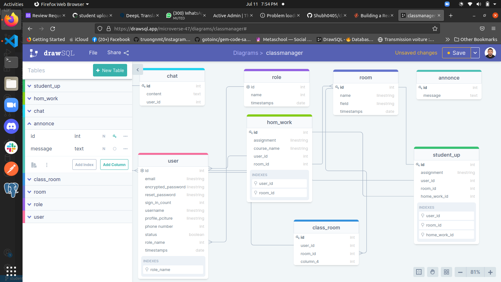

# CLASS MANAGER

> Class Manager is a Student-Teacher Portal where techers and student can sign up and teachers can add students in their class assign task and add note by student.

  
 - Class Manager contains more features like:

    - Only an admin can create room and classroom
    - Only an admin can update the role of a student or a teacher
    - Only an admin can add Teacher and student in a class_room
    - Teachers can remove a student in a class_room if he makes noices or something else 
    - Teachers can add or edit their student's marks
    - Teachers can also write notice which will be sent to all students in their class.
    - Teachers can upload assignments which will be sent to all students in their class and students can download the assignments.
    - Students can also submit their assignment but once submitted can't be changed later.
    - Teachers can also see all the mark given by them to a student through their marks profile and can edit them if necessary.
    - Teachers can see all the messages written by students in Inbox.
    - Students can see marks given to them by teachers in marks section.
    - Students can see the list of all teachers in the portal and can message any of them.
    - Students can see their profile through profile option.
    - Students can add profile picture and edit their profile through edit profile.
    - Students can also change their password if necessary.

### Deployment

[N/A]()

## Built With

- Rails
- Ruby 
- Postgresql
- Devise
- JWT
- Pundit
- ActiveRecord Serializer
- ActiveRecord Image Uploader
- Cloudinary
- Heroku

## Getting Started

Here are the steps to follow in order to get this project on your local computer.

### Prerequisites

`rails v7.0.3 +`

`ruby v3.1.2 +`

### Setup

clone this repo by typing `git clone https://github.com/vic778/Class-manager`

### Install

install the dependencies by typing `bundle install`

### Usage

start the local server by running `rails s`

### Testing

run the tests by typing `bundle exec rspec`

### Documentation

## Author

👤 **Victor Barh**

- GitHub: [@Vvic778](https://github.com/vic778)
- Twitter: [@victoirBarh](https://twitter.com/)
- LinkedIn: [LinkedIn](https://linkedin.com/in/victoir-barh)

## 🤝 Contributing

Contributions, issues and feature requests are welcome!

Feel free to check the [issues page](issues/).

## Show your support

Give a ⭐️ if you like this project!

## Acknowledgments

 N/A

## 📝 License

This project is [MIT](lic.url) licensed.

